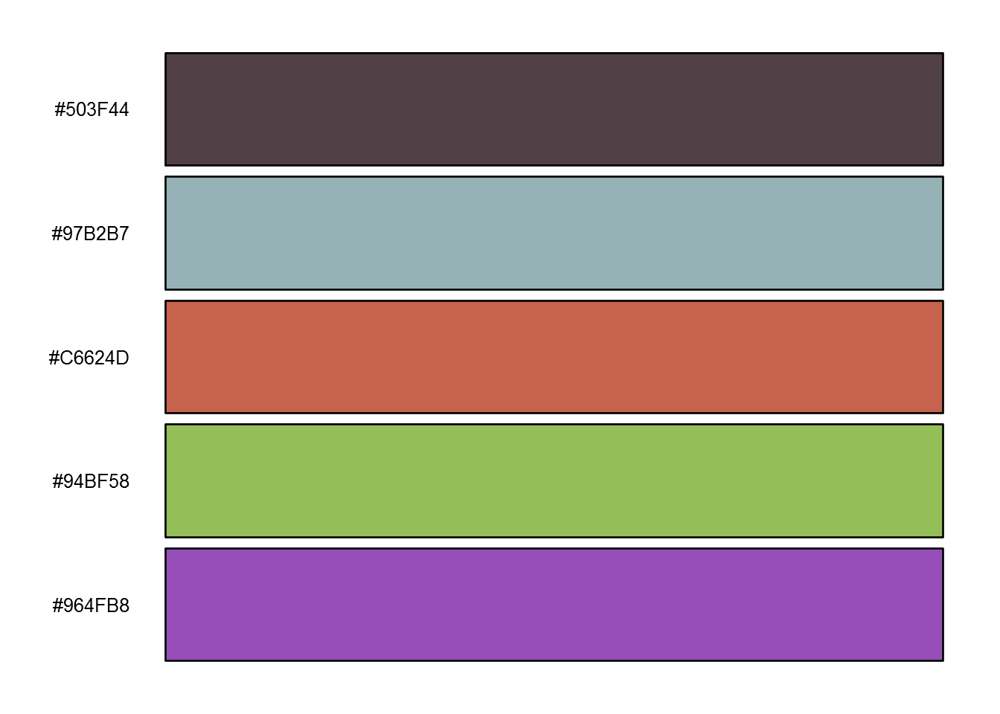
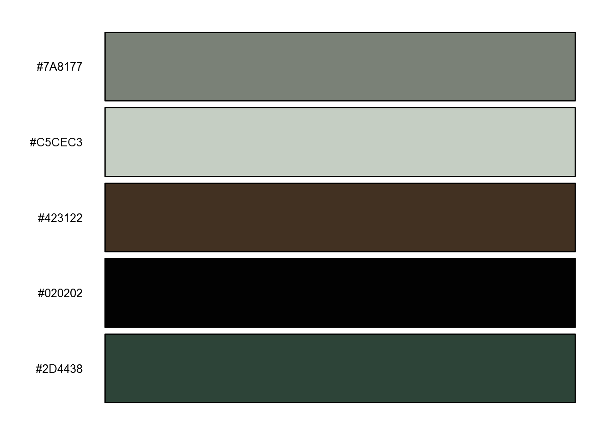
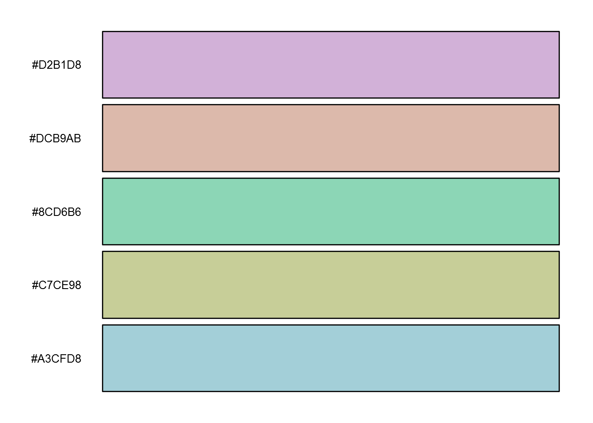
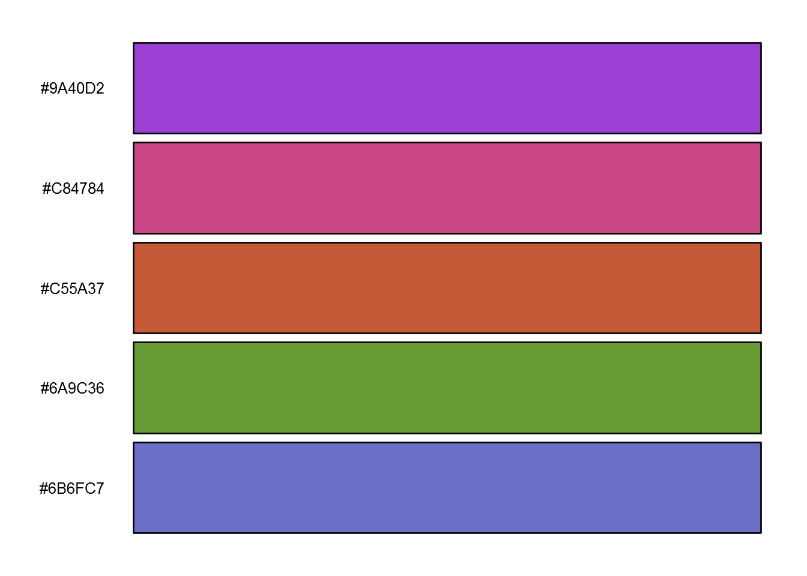
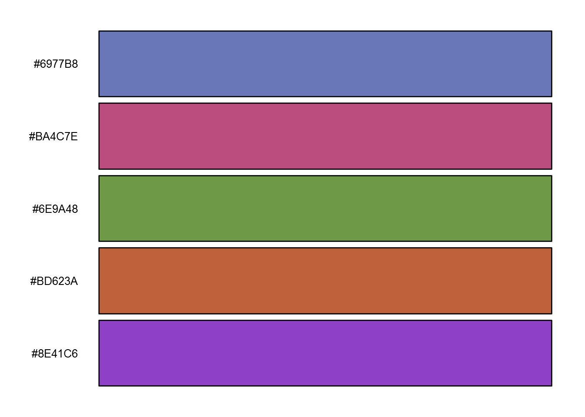
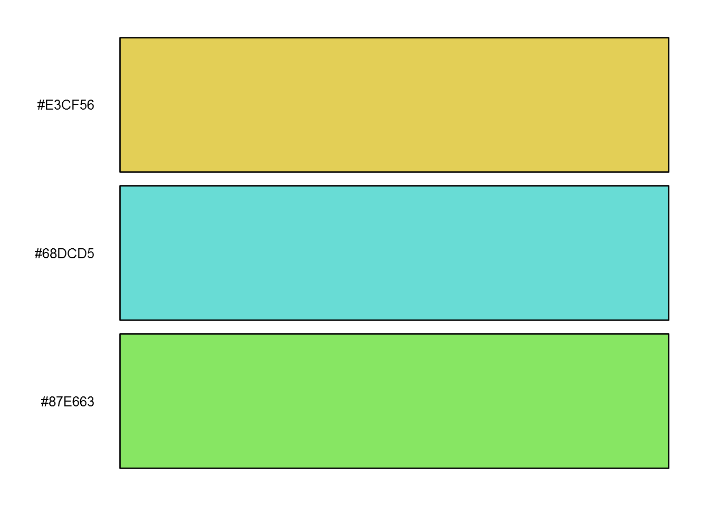
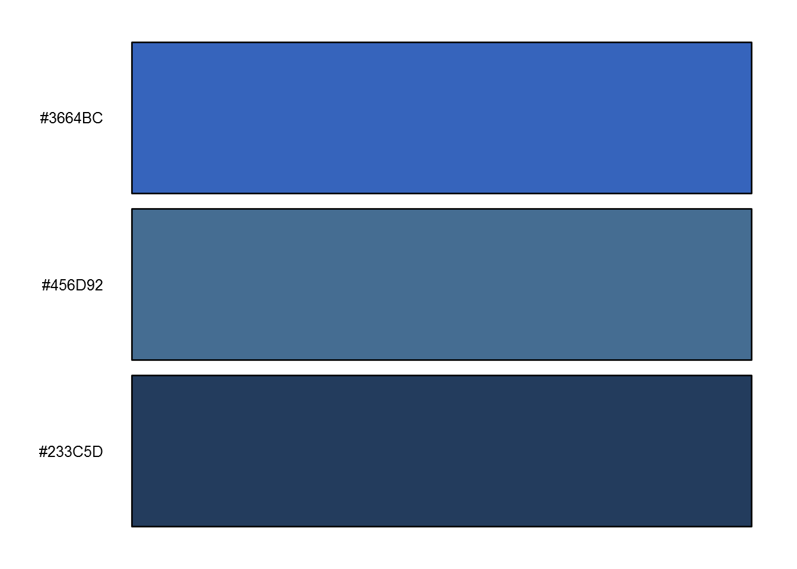

<!-- README.md is generated from README.Rmd. Please edit that file -->
hues
====

[](https://travis-ci.org/johnbaums/hues)

This package generates and plot palettes of optimally distinct colours in perceptually uniform colour space, based on [iwanthue](http://tools.medialab.sciences-po.fr/iwanthue/). This is done through k-means clustering of CIE Lab colour space, according to user-selected constraints on hue, chroma, and lightness.

### Examples

The examples below show palettes corresponding to some presets given at the [iwanthue](http://tools.medialab.sciences-po.fr/iwanthue) website.

``` r
library(hues)
iwanthue(5, plot=TRUE)
```



    ##         1         2         3         4         5 
    ## "#503F44" "#97B2B7" "#C6624D" "#94BF58" "#964FB8"
    iwanthue(5, 0, 240, 0, 24, 0, 100, plot=TRUE)    # shades



    ##         1         2         3         4         5 
    ## "#7A8177" "#C5CEC3" "#423122" "#020202" "#2D4438"
    iwanthue(5, 0, 360, 0, 54, 67, 100, plot=TRUE)   # pastel



    ##         1         2         3         4         5 
    ## "#D2B1D8" "#DCB9AB" "#8CD6B6" "#C7CE98" "#A3CFD8"
    iwanthue(5, 0, 360, 54, 180, 27, 67, plot=TRUE)  # pimp



    ##         1         2         3         4         5 
    ## "#9A40D2" "#C84784" "#C55A37" "#6A9C36" "#6B6FC7"
    iwanthue(5, 0, 360, 36, 180, 13, 73, plot=TRUE)  # intense



    ##         1         2         3         4         5 
    ## "#6977B8" "#BA4C7E" "#6E9A48" "#BD623A" "#8E41C6"
    iwanthue(3, 0, 300, 60, 180, 73, 100, plot=TRUE) # fluoro



    ##         1         2         3 
    ## "#E3CF56" "#68DCD5" "#87E663"
    iwanthue(3, 220, 260, 12, 150, 0, 53, plot=TRUE) # blue ocean



    ##         1         2         3 
    ## "#3664BC" "#456D92" "#233C5D"

### Installation

The development version of `hues` can be installed using `install_github` from the [`devtools`](https://cran.r-project.org/web/packages/devtools/index.html) package:

``` r
# install.packages('devtools') # uncomment if devtools isn't already installed
devtools::install_github('johnbaums/hues')
```
