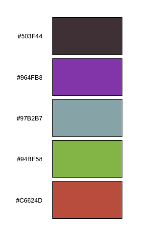
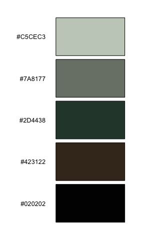
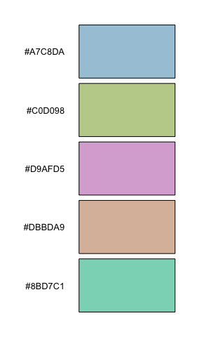
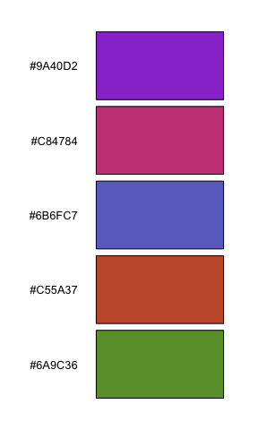
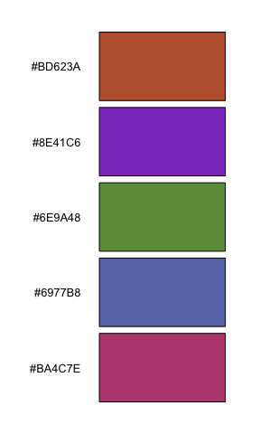
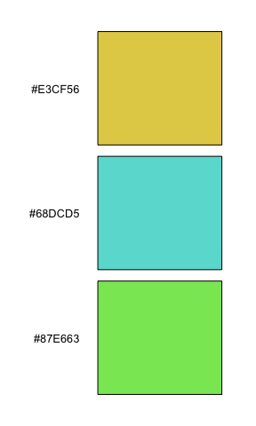
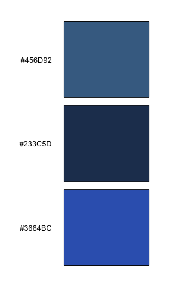
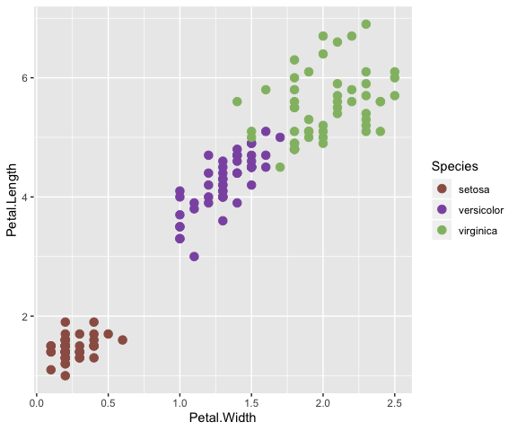
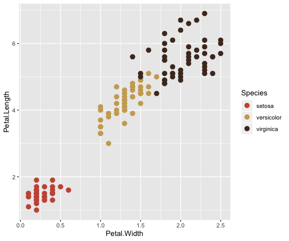
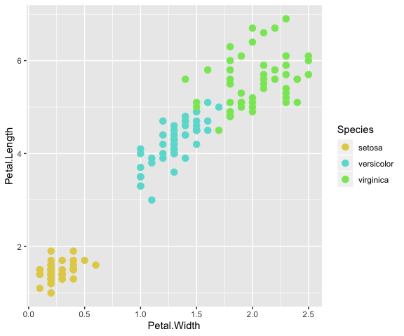

<!-- README.md is generated from README.Rmd. Please edit that file -->

hues
====

[](https://travis-ci.org/johnbaums/hues)
[](https://cran.r-project.org/package=hues)

This package generates and plot palettes of optimally distinct colours
in perceptually uniform colour space, based on
[iwanthue](http://tools.medialab.sciences-po.fr/iwanthue/). This is done
through k-means clustering of CIE Lab colour space, according to
user-selected constraints on hue, chroma, and lightness.

`iwanthue` palettes can be added directly onto
[ggplot2](https://github.com/tidyverse/ggplot2) objects via the function
`scale_colour_iwanthue`.

### Installation

The current CRAN version of `hues` can be installed with:

``` r
install.packages('hues')
```

The development version of `hues` can be installed using
`install_github` from the
[`devtools`](https://cran.r-project.org/package=devtools)
package:

``` r
# install.packages('devtools') # uncomment if devtools isn't already installed
devtools::install_github('johnbaums/hues')
```

### Examples

The examples below show palettes corresponding to some presets given at
the [iwanthue](http://tools.medialab.sciences-po.fr/iwanthue) website.

``` r
library(hues)
iwanthue(5, plot=TRUE)
```



``` r
iwanthue(5, 0, 240, 0, 24, 0, 100, plot=TRUE)    # shades
```



``` r
iwanthue(5, 0, 360, 0, 54, 67, 100, plot=TRUE)   # pastel
```



``` r
iwanthue(5, 0, 360, 54, 180, 27, 67, plot=TRUE)  # pimp
```



``` r
iwanthue(5, 0, 360, 36, 180, 13, 73, plot=TRUE)  # intense
```



``` r
iwanthue(3, 0, 300, 60, 180, 73, 100, plot=TRUE) # fluoro
```



``` r
iwanthue(3, 220, 260, 12, 150, 0, 53, plot=TRUE) # blue ocean
```



### `ggplot2` integration

``` r
library(ggplot2)
ggplot(iris, aes(x=Petal.Width, y=Petal.Length)) +
  geom_point(aes(color=Species), size=3) + 
  scale_colour_iwanthue()
```



``` r
ggplot(iris, aes(x=Petal.Width, y=Petal.Length)) +
  geom_point(aes(color=Species), size=3) + 
  scale_colour_iwanthue(hmax = 90)
```



``` r
ggplot(iris, aes(x=Petal.Width, y=Petal.Length)) +
  geom_point(aes(color=Species), size=3) + 
  scale_colour_iwanthue(hmin=0, hmax=300, cmin=60, cmax=180, lmin=73, lmax=100)
```


